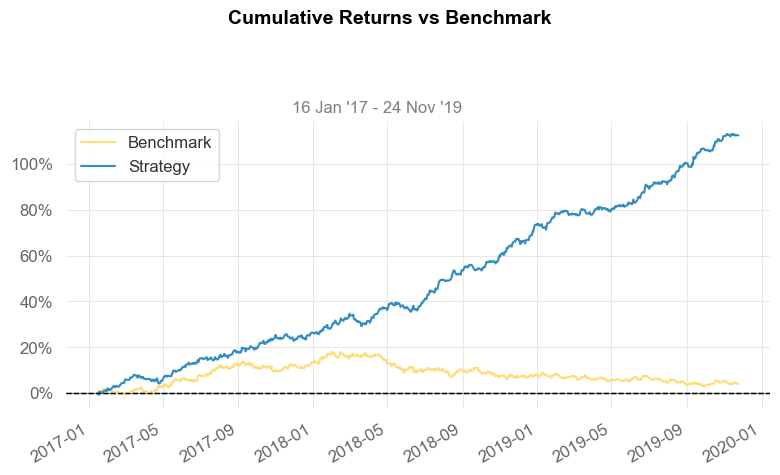

## Reinforcement Learning In Financial Trading


This project aimed to investigate the feasibility of applying different RL algorithms for producing profitable forex trading strategies on EUR/USD pair.

### Data
The study was performed on the per minute exchange data ranging from Jan 2003 to Oct 2022, collected from [Forextester](https://forextester.com) for 12 major forex pairs. Preprocessing involved forward-filling missing values and aggregating to 15 minutes time step. 

### Environment
The RL environment was designed to return a description of the current price dynamics at each time step, accept a discrete action from the agent (buy, sell, or do nothing) and return the associated reward with the description of the next time step. 

The initial features chosen to represent the environment states were the 8 most recent log returns on the target pair (EUR/USD) price and other 11 Forex trading pairs, calendar features, and the current position value, similar to [Financial Trading as a Game: A Deep Reinforcement Learning Approach](https://arxiv.org/abs/1807.02787). 

The reward was implemented as a log percentage change in portfolio balance between consecutive time steps:
$$
r_t = log(\frac{p_t}{p_{t-1}})
$$.
Two commission types were considered for the task: bid-ask spread and percentage fee.

Additional emphasis was placed on feature engineering by introducing an extended set of features comprising of multiple lagged major technical indicators such as RSI, MACD, Bollinger Bands, and others. 


The environment was implented in [Gym](https://gymnasium.farama.org).


### Agent architectures
The considered RL algorithms were chosen as a representative set of model-free approaches, including both classic and more recent SOTA: [Deep Q-Learning](https://arxiv.org/abs/1312.5602),  [Proximal Policy Optimization](https://arxiv.org/abs/1707.06347), [Advantage Actor-Critic](https://arxiv.org/abs/1602.01783), and others, implemented in [SB3](https://stable-baselines3.readthedocs.io/en/master/#). 
### Experiments
For the purpose of the experiments, the dataset was divided into train, validation and evaluation sets such that the evaluation and validation sets contained the last 3 years and prior last 3 years worth of data respectively (100,000 time steps each).

 Default hyperparameter values located under `hyperparparameters/default` were used during training, which consisted of 20 episodes of full train set runs. 
Hyperparameter tuning was conducted in the following settings:
* DQN, 2 actions (Buy/Sell), 0.0001 spread, basic + TA features
* PPO, 2 actions (Buy/Sell), no fees, basic + TA features 

using Optuna's TPESampler with 40 and 20 trials respectively. Tuned hyperparemeters can be found under `hyperparparameters/tuned`. 

Experiments were performed with different commission levels, as well as with and without TA features. Both fully sequential and randomly sub-sampled runs were considered. 

Custom fork of [RL Baselines3 Zoo](https://stable-baselines3.readthedocs.io/en/master/guide/rl_zoo.html), [D3F4LT4ST/rl-baselines3-zoo](https://github.com/D3F4LT4ST/rl-baselines3-zoo/tree/debeb3a5f536ad5adeca9d28a6028f19dd1d65d2) was used as a training framework. 


### Results

<center></center>
<center>Validation set performance of different algorithms during the training process</center>
<br>

In the commission-free environments, PPO model was found to be capable of consistently generating profit several years after training period and outperforming the base exchange rate. The applicability of obtained AI strategies is still limited, primarily due to the commission factor. The conducted experiments have illustrated that introducing any kind of commission severely lowered the agent profitability, irrespective of the architecture. Such effect can be attributed to the high-frequency behavior demonstrated by the agents in zero-fee environments, which results in significant cost being incurred. Performed experiments aimed at teaching the agent to conduct less frequent but confident trades did not produce the desired outcomes. DQN and A2C architectures were observed to converge to simplistic buy-and-hold or sell-and-hold strategies, while the PPO models were found to continue high-frequency trading and thus incur the most losses.


 <br>

 <br>

 <br>
<center>Tuned PPO model performance compared to EUR/USD on validation (left) and evaluation (right) sets</center>
<br>

|                          | PPO Val       | EUR/USD Val | PPO Eval     | EUR/USD Eval|  
|--------------------------|---------------|-------------|--------------|-------------|
| Start Period             | 2017-01-16    | 2017-01-16  | 2019-11-24   | 2019-11-24  |
| End Period               | 2019-11-24    | 2019-11-24  | 2022-09-30   | 2022-09-30  |
| Cumulative Return        | <b>112.53%</b>| 3.95%       | <b>46.31%</b>| -11.02%     |
| Sharpe                   | <b>3.26</b>   | 0.2         | <b>1.49</b>  | -0.42       |
| Sortino                  | <b>5.77</b>   | 0.28        | <b>2.45</b>  | -0.57       |
| Max Drawdown             | <b>-4.06%</b> | -12.86%     | <b>-6.94%</b>|-22.45%      |
| Longest DD Days          | <b>61</b>     | 660         | <b>220</b>   | 631         |
| Volatility (ann.)        | 5.64%         | <b>5.57%</b>| 6.31%        | <b>6.24%</b>|
| Expected Daily %         | <b>0.07%</b>  | 0.0%        | <b>0.04%</b> | -0.01%      |
| Expected Monthly %       | <b>2.18%</b>  | 0.11%       | <b>1.09%</b> | -0.33%      |
| Expected Yearly %        | <b>28.57%</b> | 1.3%        | <b>9.98%</b> | -2.88%      |
| Gain/Pain Ratio          | <b>0.84</b>   | 0.04        | <b>0.34</b>  | -0.08       |
| Outlier Win Ratio        | 4.08          | <b>4.89</b> | 4.82         | <b>5.42</b> |

### Notebooks
* Data collection: `notebooks/forex_data_collection.ipynb`
* Data preprocessing: `notebooks/forex_data_preproc_eda.ipynb`
* Feature engineering: `notebooks/forex_data_feature_engineering_basic.ipynb`, `notebooks/forex_data_feature_engineering_ta.ipynb`
* RL Experiments: `notebooks/forex_full_eurusd_rl_experiments.ipynb`
* Best models analysis: `notebooks/forex_full_eurusd_best_rl_models_analysis.ipynb`

### Installation
```
git clone --recurse-submodules https://github.com/D3F4LT4ST/RL-trading.git
pip install -r requirements.txt 
```